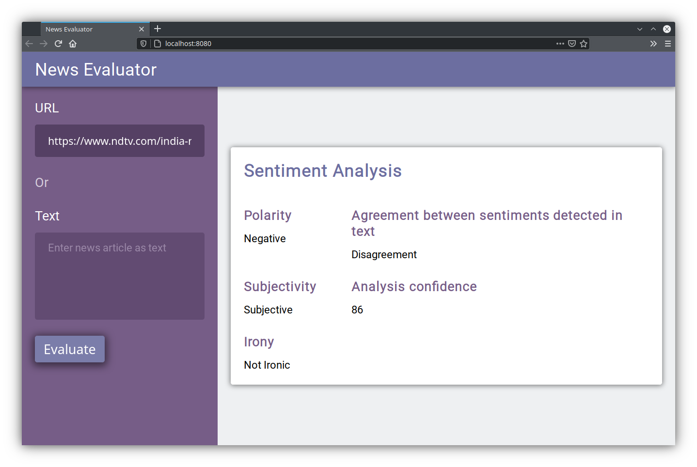

# News Evaluator



Evaluate a news article using sentiment analysis provided by [MeaningCloud](https://www.meaningcloud.com/developer/sentiment-analysis/doc/2.1/examples).

## Installation steps

Clone the repository and install node packages.

```bash
git clone https://github.com/srijan-nayak/news-evaluator.git
cd news-evaluator
npm install
```

Add your MeaningCloud API key to a .env file at the project root.

```bash
echo API_KEY=YOUR-API-KEY > .env
```

## Running dev server

Run the following commands in 2 separate terminals.

````bash
npm start
npm run dev
````

A browser window should automatically open pointing at http://localhost:8080.

## Running in production mode

First build the app then start the server.

```bash
npm run build
npm start
```
Then visit http://localhost:3000 in a browser.

## Running tests

First start the server, then run the tests in a separate terminal.

```bash
npm start
npm test
```